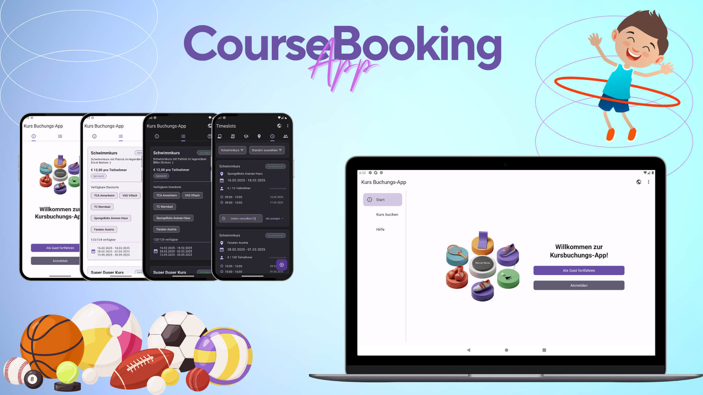

# Kurs-Buchungs-App

Eine Android-Anwendung zur Verwaltung und Buchung von Kursen mit verschiedenen Benutzerrollen und umfangreichen Funktionen.

## Entwickler
- Vladyslav Kaminchuk
- Raimund Pock

## Systemvoraussetzungen

- Android 8.0 oder höher (API Level 26+)
- Mindestens 100 MB freier Speicherplatz
- Aktive Internetverbindung

## Installation & Einrichtung

### Für Entwickler

1. Android Studio (aktuelle Version) installieren
2. Repository klonen
3. Projekt in Android Studio öffnen
4. Gradle-Synchronisierung durchführen
5. Build & Run auf einem Emulator oder echtem Gerät


## Erste Schritte

### Login-Daten für Testzwecke

- **Trainer-Portal:**
```
  - E-Mail: ****
  - Passwort: ****
  ```

- **Admin-Portal:**
```
  - E-Mail: ****
  - Passwort: ****
  ```

- **Gast-Zugang:**
  - Keine Anmeldung erforderlich
  - Direkt über "Als Gast fortfahren" zugänglich

## Hauptfunktionen

### Allgemein
- Sprachumschaltung in ActionBar
- Dark/Light Mode Auswahl in ActionBar
- Für Mobile Phones und Tablets optimiert 
- Portrait und Landscape Mode optimiert  
- Dropdown- und Slider Funktionalität bei Verwaltung 

### Gast-Portal
- Verfügbare Kurse anzeigen
- Detaillierte Kursinfos
- Optional direkte Auswahl der Standorte 
- Anzeige aller verfügbaren Timeslots
- Eingabe von Rechnungsdaten
- Direkte Übernahme der Rechnungsdaten als Teilnehmer 
- Zusätzliche Teilnehmer können hinzugefügt werden
- Bestätigungsseite
- Buchungs-Token werden am Gerät gespeichert
- Keine Anmeldung erforderlich
- Help Screen mit den wichtigsten Infos 

### Trainer-Portal
- Zugewiesene Kurse anzeigen 
- Kursdetails bearbeiten 
- Kursstandorte verwalten 
- Bestätigte und stornierte Buchungen anzeigen 
- Timeslot Verwaltung 

### Admin-Portal
- Buchungen auflisten und filtern 
- Buchungen bestätigen / löschen (wenn es die API den unterstützen würde)
- Rechnungen auflisten und filtern
- Rechnungen direkt in App via PDF Viewer anzeigen
- Rechungen in öffentliches Download-Verzeichnis herunterladen
- Rechnungstoken verlängern 
- Kurse filtern (Typ, Status, Altersgruppe)
- Kursdetails bearbeiten
- Kursstandorte verwalten 
- Kurs veröffentlichen
- Kurs archivieren / löschen (je nach API Unterstützung)
- Standortliste anzeigen 
- Standorte verwalten und erstellen 
- Timeslotliste anzeigen
- Timeslots filtern nach Kurs / Standort 
- Timeslots erstellen und bearbeiten
- Timeentries für Timeslots verwalten 
- Timeslot Trainerzuweisung verwalten 
- Benutzerliste anzeigen und filtern (nach Admin / Trainer / Guest)
- Benutzer verwalten

## Technische Features

- Material Design 3 UI-Komponenten
- Hinweis bei fehlender Internetverbindung 
- Dark/Light Mode
- Mehrsprachigkeit (DE/EN)
- PDF-Rechnungssystem
- Optimierte Performance
- Barrierefreiheit
- Responsive Layouts für verschiedene Bildschirmgrößen

## Architektur & Technologien

### Architektur
- MVVM-Architektur
- Repository Pattern
- Clean Architecture Prinzipien

### Frontend
- Material Design 3
- ViewBinding
- Navigation Component
- Custom Views

### Backend-Kommunikation
- Retrofit für API-Calls
- OkHttp für Netzwerk-Interceptors
- Gson für JSON-Verarbeitung

### Async & Reactive
- Kotlin Coroutines
- StateFlow & SharedFlow
- LiveData

### Dependency Injection
- Hilt für Dependency Injection
- Modularisierte Struktur

## Sicherheit & Berechtigungen

Die App benötigt folgende Berechtigungen:
- Internet: Für API-Kommunikation
- Speicher: Für PDF-Downloads
- Benachrichtigungen: Für Status-Updates

## Error Handling

- Umfangreiches Error Handling System
- Benutzerfreundliche Fehlerbenachrichtigungen
- Offline-Fallback wo möglich
- Validierung aller Eingaben

## Performance

- Lazy Loading von Ressourcen
- Effizientes Caching
- Optimierte Bildverarbeitung
- Minimierte App-Größe

## Entwicklungsrichtlinien

- Kotlin Coding Conventions
- Material Design Guidelines
- Clean Code Prinzipien
- Code-Dokumentation wo sinnvoll